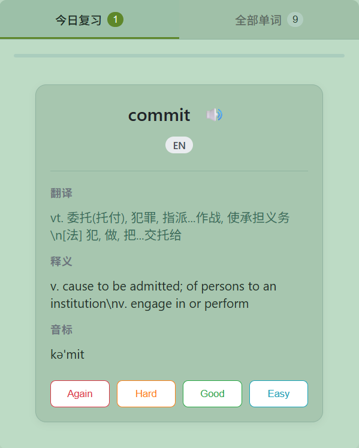
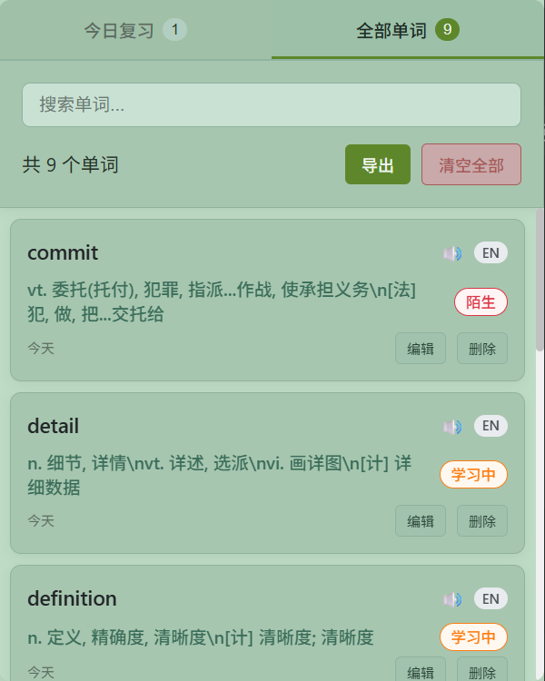

[English](#en) | [中文](#zh)

# Word SRS — Minimal English Vocabulary Saver & Reviewer
[Chrome Web Store](https://chromewebstore.google.com/detail/word-srs/oleimdgooblkakpgkekckhdjfamaakne?utm_source=chatgpt.com)

## Overview
**Word SRS** is a lightweight Chrome extension that lets you capture **English words** on the web and review them with **Spaced Repetition (SRS)**.  
It’s designed as a **companion** to full-featured vocabulary apps: save terms while browsing, then **export** to CSV/JSON and import into your main tool.

**Highlights**
- **Focused scope:** select → save English words → SRS review
- **No selection popup:** no intrusive bubbles on pages
- **Low learning curve:** right-click to save; review due cards in the popup

  

  

---

## Features
- **SRS review workflow** (Again / Hard / Good / Easy)
- **Per-word details:** Translation, **English definition**, example sentence(s), **pronunciation** (TTS)
- **Built-in offline dictionary** of **20,000 common words**
- **Mastery levels (auto-tagging)**  
  Each word shows a colored **mastery tag** in *All Words* (Unknown / Learning / Familiar / Mastered).  
  The tag updates automatically from your review outcomes over time.
- **One-click “Clear All”**  
  Clear the whole wordbook from *All Words* (with confirmation). Tip: **export first**.
- **Export** to **CSV** or **JSON** for backup **and import into other apps**
- **Clean UX:** all UI lives in the extension popup; pages stay untouched

---

## Quick Start
1. `chrome://extensions` → enable **Developer mode** → **Load unpacked** → choose this folder.
2. Select a word on any page → right-click → **Save to Wordbook**.
3. Click the extension icon → **Today’s Review** to start.
4. In **All Words**, click **Export JSON/CSV** (or **Clear All** after exporting).
---

## Permissions

- `storage` – store your word list and settings locally  
- `contextMenus` – show “Save to Wordbook” on right-click  
- `notifications` – show “Saved” toast

> **No tracking.** Your words are stored locally in the browser.  
> Offline dictionary is bundled; optional online lookup may query public APIs.

---

## Data & Credits

- **Offline dictionary:** Derived from **ECDICT** (MIT License).  
- **Common-word subset (20k):** selected via `wordfreq` frequency list.  
- Optional fallbacks: public dictionary/translation APIs (can be disabled in code).

Please keep the original licenses in your distributions.

---

# Word SRS — 极简英文生词保存与复习扩展

## 概述
**Word SRS** 是一个**轻量级**的 Chrome 扩展：在网页上**保存英文单词**，用 **SRS** 复习。  
它更像是你主力记忆软件的**拓展**：浏览时随手收集，之后**导出 CSV/JSON** 导入到其他应用继续巩固。

**亮点**
- **专注一件事：** 划词保存 → SRS 复习
- **不打扰：** 不在页面上弹气泡
- **上手快：** 右键保存即可，复习在扩展弹层完成

  

---

## 功能
- **SRS 记忆流程**（Again / Hard / Good / Easy）
- **单词详情**：翻译、**英文释义**、例句、**发音**（TTS）
- **内置离线词典**：收录 **2 万常用词**
- **掌握度分级（自动标签）**  
  在“全部单词”列表为每个词显示**掌握度**：**陌生 / 学习中 / 熟悉 / 已掌握**。  
  标签会随你的复习点击自动更新。
- **一键清空**  
  在“全部单词”页支持**清空全部单词**（带确认提示，**建议先导出**）。
- **导出**  
  支持导出为 **CSV** / **JSON**，便于备份或导入其他记忆软件。
- **干净体验**：所有交互在扩展弹层中完成，不影响网页

---

## 快速上手
1. 打开 `chrome://extensions` → 开启**开发者模式** → **加载已解压的扩展程序**。
2. 网页中选中单词 → 右键 **保存到生词本**。
3. 点击扩展图标 → **今日复习**。
4. 在 **全部单词** 中 **导出 JSON/CSV**（或清空全部）。

---

## 权限说明

- `storage`：在本地保存你的单词与设置  
- `contextMenus`：右键菜单“保存到生词本”  
- `notifications`：保存成功提示

> **隐私声明：** 单词数据仅保存在你的浏览器本地。  
> 内置词典可离线使用；在线查询仅在本地缺失时调用（可在代码中关闭）。

---

## 数据与致谢

- **离线词典：** 基于 **ECDICT**（MIT 许可）  
- **常用词子集（20k）：** 通过 `wordfreq` 词频筛选  
- 在线兜底：公共字典/翻译接口（可在代码中关闭）

请保留上游数据许可与署名。

---